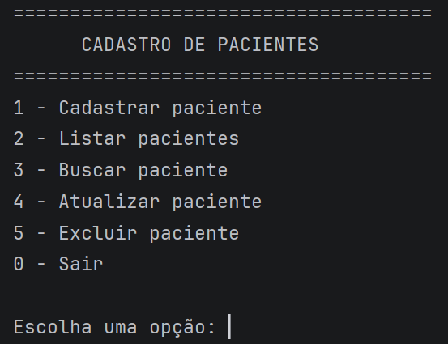
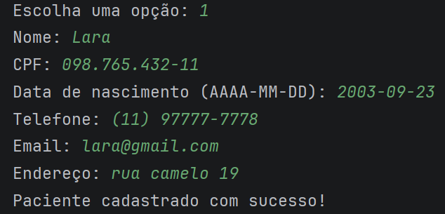
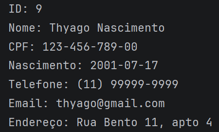

# Cadastro de Pacientes

Sistema CRUD desenvolvido em Java utilizando JDBC e PostgreSQL.

## Objetivo

Este projeto foi desenvolvido para praticar Programação Orientada a Objetos, JDBC e operações CRUD utilizando Java e PostgreSQL.

## Tecnologias Utilizadas

- Java
- JDBC
- PostgreSQL
- Maven
- IntelliJ IDEA

## Funcionalidades

- Cadastro de pacientes
- Listagem
- Busca por ID
- Atualização
- Exclusão de pacientes

## Estrutura

- **model** → Classe `Paciente`
- **dao** → Operações de acesso ao banco de dados (CRUD)
- **database** → Conexão com o PostgreSQL
- **ui** → Interface via terminal
- **Main** → Inicialização da aplicação
 
## Como executar

1. Clone o projeto
2. Configure os dados de conexão com o PostgreSQL na classe Conexao.java.
3. Execute a classe `Main`.

## 🖥️ Menu Principal

## ➕ Cadastro de Paciente

## 📋 Listagem de Pacientes

